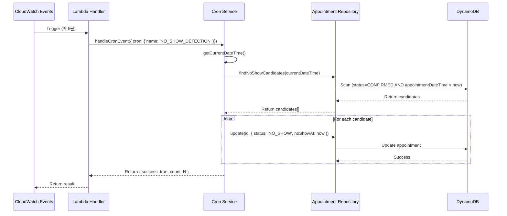

# 예약 부도 감지 기능 설계 문서

## 개요

예약 시간이 지났음에도 환자가 내원하지 않은 경우를 자동으로 감지하여 예약 상태를 "부도(NO_SHOW)"로 변경하는 배치 작업입니다.

---

## 요구사항

1. **주기**: 최소 5분마다 실행
2. **대상**: 예약 시간이 경과했으나 상태가 여전히 'CONFIRMED'인 예약
3. **제외**: 이미 취소('CANCELLED')된 예약은 부도 처리하지 않음
4. **로깅**: 부도 처리된 예약 건수 기록

---

## 아키텍처

### 1. 실행 방식

**AWS CloudWatch Events (EventBridge) + Lambda**

```
┌─────────────────┐      ┌──────────────┐      ┌─────────────────┐
│ CloudWatch      │      │ Lambda       │      │ DynamoDB        │
│ Events          │─────>│ Function     │─────>│ Appointment     │
│ (Cron: 0/5 *)   │      │ (Cron        │      │ Table           │
│                 │      │ Handler)     │      │                 │
└─────────────────┘      └──────────────┘      └─────────────────┘
```

### 2. Serverless 설정

**serverless.yml**:

```yaml
functions:
  lambda:
    handler: handler.lambda
    events:
      - schedule:
          name: appointment-noshow-detection-${stage}
          description: 'Detect and mark no-show appointments every 5 minutes'
          rate: 'cron(0/5 * * * ? *)'  # 매 5분마다 실행
          enabled: true
          input:
            cron:
              name: NO_SHOW_DETECTION
              stage: ${stage}
```

**Cron 표현식 설명**:
- `cron(0/5 * * * ? *)`: 매시 0, 5, 10, 15, ... 55분에 실행
- CloudWatch Events의 cron은 UTC 기준 (한국 시간보다 9시간 느림)

---

## 동작 흐름



---

## 구현 세부사항

### 1. Cron Handler (`src/api/cron.handler.ts`)

```typescript
export const handleCronEvent = async (event: any) => {
    const cronName = event?.cron?.name;
    
    if (cronName === 'NO_SHOW_DETECTION') {
        return await handleNoShowDetection();
    }
    
    return { success: false, message: 'Unknown cron job' };
};

const handleNoShowDetection = async () => {
    const service = new AppointmentService();
    const count = await service.markNoShows();
    
    return {
        success: true,
        count,
        message: `Marked ${count} appointments as no-show`,
    };
};
```

### 2. Service Layer (`src/services/appointment.service.ts`)

```typescript
async markNoShows(): Promise<number> {
    const currentDateTime = nowKST(); // 현재 KST 시각
    const candidates = await this.appointmentRepo.findNoShowCandidates(currentDateTime);
    
    let count = 0;
    for (const appointment of candidates) {
        await this.appointmentRepo.update(appointment.id, {
            status: $LUT.AppointmentStatus.noShow,
            noShowAt: currentDateTime,
        });
        count++;
    }
    
    return count;
}
```

### 3. Repository Layer (`src/repositories/appointment.repository.ts`)

```typescript
async findNoShowCandidates(currentDateTime: string): Promise<AppointmentModel[]> {
    const params = {
        TableName: this.tableName,
        FilterExpression:
            '#status = :confirmed AND appointmentDateTime < :currentDateTime AND attribute_not_exists(deletedAt)',
        ExpressionAttributeNames: {
            '#status': 'status',
        },
        ExpressionAttributeValues: {
            ':confirmed': 'CONFIRMED',
            ':currentDateTime': currentDateTime,
        },
    };
    
    const result = await dynamoDB.scan(params).promise();
    return result.Items as AppointmentModel[];
}
```

---

## 시간 처리

### 1. 타임존 설정

**서버 환경변수**:
```yaml
environment:
  TZ: 'Asia/Seoul'  # 시스템 타임존 강제 설정
```

**DynamoDB 시간 저장 형식**:
```typescript
// ISO 8601 형식 with timezone
appointmentDateTime: "2025-01-25T14:00:00+09:00"
checkInTime: "2025-01-25T14:05:32+09:00"
```

### 2. 부도 판정 로직

```typescript
// 예약 시간: 2025-01-25T14:00:00+09:00
// 현재 시간: 2025-01-25T14:05:00+09:00
// 상태: CONFIRMED
// → 부도 대상

// 조건:
// 1. appointmentDateTime < currentDateTime  (시간 경과)
// 2. status === 'CONFIRMED'                 (아직 확정 상태)
// 3. !deletedAt                             (삭제되지 않음)
```

---

## 성능 최적화

### 1. Scan 최적화 고려사항

**문제점**:
- DynamoDB Scan은 전체 테이블을 읽어야 하므로 비용/성능 문제 가능
- 예약 데이터가 수십만 건 이상일 경우 성능 저하

**개선 방안**:

#### Option 1: GSI 활용 (추천)

```yaml
# appointmentDateTime-status-index 추가
GlobalSecondaryIndexes:
  - IndexName: appointmentDateTime-status-index
    KeySchema:
      - AttributeName: appointmentDateTime
        KeyType: HASH
      - AttributeName: status
        KeyType: RANGE
```

```typescript
// Query 사용 (Scan 대신)
async findNoShowCandidates(currentDate: string): Promise<AppointmentModel[]> {
    // 오늘과 과거 날짜들을 쿼리
    const dates = getLastNDates(7); // 최근 7일치만 체크
    const results = [];
    
    for (const date of dates) {
        const result = await this.queryByIndex(
            'appointmentDateTime-status-index',
            'appointmentDateTime = :date AND #status = :confirmed',
            { ':date': date, ':confirmed': 'CONFIRMED' }
        );
        results.push(...result.items);
    }
    
    return results.filter(apt => apt.appointmentDateTime < nowKST());
}
```

#### Option 2: 상태별 TTL (Time To Live)

```yaml
# DynamoDB TTL 설정
TimeToLiveSpecification:
  AttributeName: ttl
  Enabled: true
```

```typescript
// 예약 생성 시 TTL 설정 (예약 시간 + 1일)
const appointment = {
    ...data,
    ttl: Math.floor(new Date(appointmentDateTime).getTime() / 1000) + 86400,
};
```

#### Option 3: Stream 기반 처리

```yaml
# DynamoDB Stream 활성화
StreamSpecification:
  StreamViewType: NEW_AND_OLD_IMAGES
```

```typescript
// Stream handler에서 실시간 처리
export const streamHandler = async (event: DynamoDBStreamEvent) => {
    for (const record of event.Records) {
        if (record.eventName === 'MODIFY') {
            const newImage = record.dynamodb.NewImage;
            if (shouldMarkAsNoShow(newImage)) {
                await markNoShow(newImage.id);
            }
        }
    }
};
```

---

## 에러 처리

### 1. 부분 실패 허용

```typescript
async markNoShows(): Promise<number> {
    const candidates = await this.appointmentRepo.findNoShowCandidates(currentDateTime);
    
    let count = 0;
    const errors = [];
    
    for (const appointment of candidates) {
        try {
            await this.appointmentRepo.update(appointment.id, {
                status: $LUT.AppointmentStatus.noShow,
                noShowAt: currentDateTime,
            });
            count++;
        } catch (error) {
            errors.push({ id: appointment.id, error: error.message });
            _err(`[NoShow] Failed to mark ${appointment.id}:`, error);
        }
    }
    
    if (errors.length > 0) {
        _err(`[NoShow] ${errors.length} failures:`, errors);
    }
    
    return count;
}
```

### 2. Dead Letter Queue (DLQ)

```yaml
functions:
  lambda:
    onError: arn:aws:sns:${region}:${accountId}:appointment-dlq
    reservedConcurrency: 1  # 동시 실행 제한
```

---

## 모니터링 및 알림

### 1. CloudWatch Metrics

```typescript
const cloudwatch = new AWS.CloudWatch();

await cloudwatch.putMetricData({
    Namespace: 'Appointment',
    MetricData: [{
        MetricName: 'NoShowCount',
        Value: count,
        Unit: 'Count',
        Timestamp: new Date(),
    }],
}).promise();
```

### 2. SNS 알림

```typescript
// 부도 건수가 많을 경우 알림
if (count > 10) {
    await sns.publish({
        TopicArn: process.env.SNS_TOPIC_ARN,
        Subject: 'High No-Show Rate Alert',
        Message: `${count} appointments marked as no-show`,
    }).promise();
}
```

---

## 테스트 시나리오

### 1. 정상 시나리오

```typescript
test('should mark past confirmed appointments as no-show', async () => {
    // Given: 과거 시간의 CONFIRMED 예약
    const past = new Date();
    past.setHours(past.getHours() - 1);
    
    const appointment = await createAppointment({
        appointmentDateTime: past.toISOString(),
        status: 'CONFIRMED',
    });
    
    // When: Cron 실행
    const count = await service.markNoShows();
    
    // Then: 부도 처리됨
    expect(count).toBe(1);
    const updated = await getAppointment(appointment.id);
    expect(updated.status).toBe('NO_SHOW');
    expect(updated.noShowAt).toBeDefined();
});
```

### 2. 예외 시나리오

```typescript
test('should not mark cancelled appointments', async () => {
    // Given: 취소된 예약
    const appointment = await createAppointment({
        status: 'CANCELLED',
    });
    
    // When: Cron 실행
    const count = await service.markNoShows();
    
    // Then: 변경 없음
    expect(count).toBe(0);
});

test('should not mark future appointments', async () => {
    // Given: 미래 시간의 예약
    const future = new Date();
    future.setHours(future.getHours() + 1);
    
    const appointment = await createAppointment({
        appointmentDateTime: future.toISOString(),
        status: 'CONFIRMED',
    });
    
    // When: Cron 실행
    const count = await service.markNoShows();
    
    // Then: 변경 없음
    expect(count).toBe(0);
});
```

---

## 배포 및 운영

### 1. 배포

```bash
# Cron 활성화 상태로 배포
npm run deploy.prod
```

### 2. Cron 비활성화 (필요시)

```yaml
functions:
  lambda:
    events:
      - schedule:
          enabled: false  # 비활성화
```

### 3. 수동 실행 (테스트)

```bash
# AWS CLI로 수동 실행
aws lambda invoke \
    --function-name linediet-appointment-api-prod-lambda \
    --payload '{"cron":{"name":"NO_SHOW_DETECTION","stage":"prod"}}' \
    response.json
```

---

## 결론

이 설계는 5분 주기로 안정적으로 예약 부도를 감지하며, 향후 데이터 증가에 따라 GSI 기반 Query로 최적화 가능한 구조입니다.
