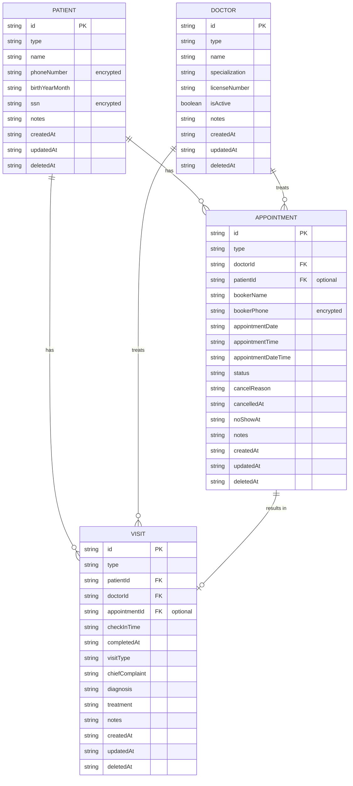

# 데이터베이스 설계 문서

## ERD (Entity Relationship Diagram)



## 테이블 설계

### 1. Patient Table (환자)

**테이블명**: `appointment-patients-{stage}`

| 필드 | 타입 | 설명 | 인덱스 |
|------|------|------|--------|
| id | String (PK) | 환자 고유 ID | Primary Key |
| type | String | 모델 타입 ('patient') | - |
| name | String | 환자 이름 | - |
| phoneNumber | String | 암호화된 전화번호 | GSI (phoneNumber-index) |
| birthYearMonth | String | 출생연월 (YYYYMM) | - |
| ssn | String | 암호화된 주민등록번호 | - |
| notes | String | 추가 메모 | - |
| createdAt | String | 생성 시각 (ISO) | - |
| updatedAt | String | 수정 시각 (ISO) | - |
| deletedAt | String | 삭제 시각 (ISO, soft delete) | - |

**Global Secondary Indexes (GSI)**:
- `phoneNumber-index`: phoneNumber (HASH)

**설계 이유**:
- 전화번호로 환자를 빠르게 검색하기 위해 GSI 추가
- 개인정보 보호를 위해 phoneNumber, ssn은 암호화 저장

---

### 2. Doctor Table (진료의)

**테이블명**: `appointment-doctors-{stage}`

| 필드 | 타입 | 설명 | 인덱스 |
|------|------|------|--------|
| id | String (PK) | 진료의 고유 ID | Primary Key |
| type | String | 모델 타입 ('doctor') | - |
| name | String | 진료의 이름 | - |
| specialization | String | 전문 분야 | - |
| licenseNumber | String | 면허 번호 | - |
| isActive | Boolean | 활성 상태 | - |
| notes | String | 추가 메모 | - |
| createdAt | String | 생성 시각 (ISO) | - |
| updatedAt | String | 수정 시각 (ISO) | - |
| deletedAt | String | 삭제 시각 (ISO) | - |

**설계 이유**:
- 진료의 수가 많지 않아 별도 인덱스 불필요
- isActive 필드로 재직/퇴직 관리

---

### 3. Appointment Table (예약)

**테이블명**: `appointment-appointments-{stage}`

| 필드 | 타입 | 설명 | 인덱스 |
|------|------|------|--------|
| id | String (PK) | 예약 고유 ID | Primary Key |
| type | String | 모델 타입 ('appointment') | - |
| doctorId | String | 진료의 ID | GSI (doctorId-appointmentDate-index) |
| patientId | String | 환자 ID (선택) | GSI (patientId-appointmentDate-index) |
| bookerName | String | 예약자 이름 | - |
| bookerPhone | String | 암호화된 예약자 전화번호 | - |
| appointmentDate | String | 예약 날짜 (YYYY-MM-DD) | GSI (appointmentDate-index) |
| appointmentTime | String | 예약 시간 (HH:mm) | - |
| appointmentDateTime | String | 예약 일시 (ISO) | - |
| status | String | 예약 상태 (CONFIRMED/CANCELLED/NO_SHOW) | - |
| cancelReason | String | 취소 사유 | - |
| cancelledAt | String | 취소 시각 (ISO) | - |
| noShowAt | String | 부도 처리 시각 (ISO) | - |
| notes | String | 추가 메모 | - |
| createdAt | String | 생성 시각 (ISO) | - |
| updatedAt | String | 수정 시각 (ISO) | - |
| deletedAt | String | 삭제 시각 (ISO) | - |

**Global Secondary Indexes (GSI)**:
1. `doctorId-appointmentDate-index`: doctorId (HASH) + appointmentDate (RANGE)
2. `patientId-appointmentDate-index`: patientId (HASH) + appointmentDate (RANGE)
3. `appointmentDate-index`: appointmentDate (HASH)

**설계 이유**:
- 진료의별, 날짜별 예약 조회가 빈번하므로 복합 인덱스 사용
- 환자별 예약 조회를 위한 별도 GSI
- 특정 날짜 전체 예약 조회를 위한 단일 키 GSI
- 예약 시간은 30분 단위 (HH:00, HH:30)로 제한하여 슬롯 관리 용이
- 중복 예약 체크를 위해 doctorId + appointmentDateTime 조합 활용

---

### 4. Visit Table (내원)

**테이블명**: `appointment-visits-{stage}`

| 필드 | 타입 | 설명 | 인덱스 |
|------|------|------|--------|
| id | String (PK) | 내원 고유 ID | Primary Key |
| type | String | 모델 타입 ('visit') | - |
| patientId | String | 환자 ID | GSI (patientId-checkInTime-index) |
| doctorId | String | 진료의 ID | - |
| appointmentId | String | 예약 ID (선택) | - |
| checkInTime | String | 접수 시각 (ISO) | - |
| completedAt | String | 진료 완료 시각 (ISO) | - |
| visitType | String | 내원 유형 (first/follow-up) | - |
| chiefComplaint | String | 주 호소 | - |
| diagnosis | String | 진단 | - |
| treatment | String | 치료 내역 | - |
| notes | String | 추가 메모 | - |
| createdAt | String | 생성 시각 (ISO) | - |
| updatedAt | String | 수정 시각 (ISO) | - |
| deletedAt | String | 삭제 시각 (ISO) | - |

**Global Secondary Indexes (GSI)**:
- `patientId-checkInTime-index`: patientId (HASH) + checkInTime (RANGE)

**설계 이유**:
- 환자별 내원 이력 조회가 주요 쿼리 패턴
- 시간순 정렬을 위해 checkInTime을 RANGE 키로 사용

---

## 인덱스 전략

### DynamoDB 인덱스 설계 원칙

1. **Access Pattern 기반 설계**:
   - 자주 조회하는 패턴에 맞춰 GSI 구성
   - 예약 조회: 날짜별, 진료의별, 환자별

2. **쿼리 효율성**:
   - Scan 대신 Query 사용을 위한 적절한 인덱스
   - 복합 키(HASH + RANGE)로 정렬 및 범위 검색 지원

3. **확장성**:
   - 10만+ 환자, 수십만+ 예약 데이터에도 효율적 동작
   - Pay-per-request 빌링 모드로 자동 스케일링

---

## 데이터 암호화

### 암호화 대상 필드

1. **Patient.phoneNumber**: AES 암호화
2. **Patient.ssn**: AES 암호화
3. **Appointment.bookerPhone**: AES 암호화

### 암호화 방식

- 알고리즘: AES-256
- 라이브러리: crypto-js
- 키 관리: 환경 변수 (프로덕션에서는 AWS KMS 권장)

### 로깅 시 마스킹

```typescript
// 전화번호: 010-****-1234
maskPhone("01012345678") // "010-****-5678"

// 주민번호: 123456-*******
maskSSN("1234561234567") // "123456-*******"
```

---

## Soft Delete 전략

모든 테이블에 `deletedAt` 필드를 사용하여 논리적 삭제 구현:

- 삭제 시 `deletedAt`에 현재 시각 기록
- 조회 시 `attribute_not_exists(deletedAt)` 조건으로 필터링
- 데이터 복구 가능, 감사(audit) 용이

---

## 쿼리 패턴 예시

### 1. 특정 날짜, 특정 진료의 예약 조회

```typescript
// GSI: doctorId-appointmentDate-index 사용
queryByDoctorAndDate('doctor-001', '2025-01-25')
```

### 2. 환자의 예약 이력 조회

```typescript
// GSI: patientId-appointmentDate-index 사용
queryByPatientAndDate('patient-001', '2025-01-25')
```

### 3. 특정 날짜 전체 예약 조회

```typescript
// GSI: appointmentDate-index 사용
queryByDate('2025-01-25')
```

### 4. 예약 부도 후보 검색

```typescript
// Scan with filter (배치 작업용)
findNoShowCandidates(currentDateTime)
// Filter: status = 'CONFIRMED' AND appointmentDateTime < currentDateTime
```

---

## 확장성 고려사항

1. **파티셔닝**: doctorId, patientId를 HASH 키로 사용하여 자연스러운 데이터 분산
2. **Hot Partition 방지**: appointmentDate 단독 인덱스는 특정 날짜 집중 시 성능 저하 가능 (모니터링 필요)
3. **TTL 설정**: 오래된 삭제 데이터는 DynamoDB TTL로 자동 정리 가능 (향후 추가)
4. **DynamoDB Streams**: 데이터 변경 이벤트 기반 알림/로깅 (향후 추가)
